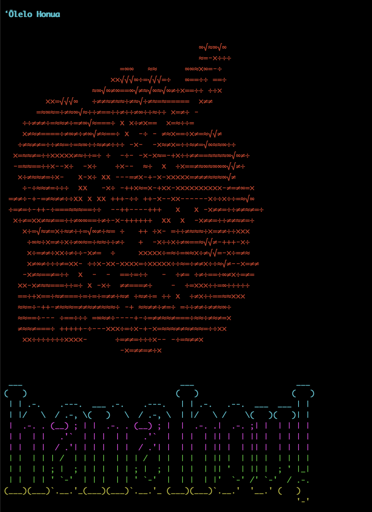

# ʻŌlelo Honua

A Node.js library that automates LLM-powered translation file generation and synchronization for i18n workflows. Point it at your base locale file, configure a provider, and it generates or updates locale files for every target language—with optional critique and repair passes for higher quality output.

Works alongside tools like [i18next](https://github.com/i18next/i18next) and [i18next-scanner](https://github.com/i18next/i18next-scanner) to fill the gap those tools leave: the actual translation.

For a detailed look at how the translation, critique, and repair pipeline works, see [docs/deep_dive.md](docs/deep_dive.md).

## Installation

```bash
npm install olelo-honua
# or
yarn add olelo-honua
```

## Quick Start

```javascript
const { OleloHonua } = require("olelo-honua");

const translator = new OleloHonua({
  provider: {
    platform: OleloHonua.Providers.OpenRouter,
    credentials: {
      apiKey: process.env.OPENROUTER_API_KEY,
    },
    modelId: OleloHonua.OpenRouterModels.NVIDIA.NEMOTRON_3_ULTRA_550B_FREE,
  },
  primeLanguage: "en",
  includeLanguage: ["haw", "es", "fr", "de", "zh", "ja", "ko", "ar", "ru"],
});

// Generate or sync all locale files
translator.hanaHou(); // alias: createLocaleFiles()
```

### `primeLanguage`

The `primeLanguage` must have a corresponding locale file (e.g. `locales/en.json`) that serves as the source for all translations. All other languages are generated from it.

## CLI

```bash
# Generate locale files from a config
npx olelo-honua init --config ./local.config.json

# Sync after updating your base locale file
npx olelo-honua sync
```

| Flag | Description |
|------|-------------|
| `--config <path>` | Path to config file. Defaults to `local.config.json` in the current directory. |
| `--debug` | Enable verbose logging. |



## Configuration

### API Key Setup

Store your API key in a `.env` file (add it to `.gitignore`):

```plaintext
OPENROUTER_API_KEY=<your_key>
```

Load it in your app:

```javascript
require("dotenv").config();
```

- [How to set up an OpenRouter API key](docs/openrouter_api_key_setup.md)
- [OpenAI API quickstart](https://platform.openai.com/docs/quickstart?api-mode=chat)
- [Google Cloud Translation quickstart](https://cloud.google.com/translate/docs/basic/translate-text-basic)

### Full Configuration Example

```json
{
  "primeLanguage": "en",
  "provider": {
    "platform": "OpenRouter",
    "credentials": {
      "apiKey": "<your_openrouter_api_key>"
    },
    "modelId": "nvidia/nemotron-3-ultra-550b-a55b:free"
  },
  "retries": {
    "mainLoop": 3,
    "critiqueLoop": 2,
    "repairLoop": 1
  },
  "debug": false,
  "includeLanguage": ["haw", "ar", "es", "fr"],
  "maxChunkRequests": 4,
  "additionalConfig": {
    "critique": true,
    "saveCritique": false,
    "repair": false,
    "multiLanguageAgreementThreshold": 0.8
  }
}
```

## Providers and Models

Supports OpenRouter, OpenAI, Google Cloud Translation, and local LLM providers.

### OpenRouter Models

OpenRouter gives you access to many free models without needing separate provider accounts. Recommended starting point.

- **NVIDIA** ⭐ default
  - `nvidia/nemotron-3-ultra-550b-a55b:free`
  - `nvidia/nemotron-3-super-120b-a12b:free`
  - `nvidia/nemotron-3-nano-30b-a3b:free`
  - `nvidia/nemotron-3-nano-omni-30b-a3b-reasoning:free`
  - `nvidia/nemotron-nano-9b-v2:free`
- **Google**
  - `google/gemma-4-31b-it:free`
  - `google/gemma-4-26b-a4b-it:free`
  - `google/gemini-3-flash-preview`
  - `google/gemini-3.5-flash`
  - `google/gemini-2.5-pro`
  - `google/gemma-3-4b-it:free`
  - `google/gemma-3-12b-it:free`
  - `google/gemma-3-27b-it:free`
- **DeepSeek**
  - `deepseek/deepseek-v4-flash`
  - `deepseek/deepseek-v4-pro`
  - `deepseek/deepseek-v3.2`
  - `deepseek/deepseek-r1-0528`
  - `deepseek/deepseek-chat-v3-0324:free` *(legacy free)*
- **Meta**
  - `meta-llama/llama-4-maverick-17b-128e-instruct`
  - `meta-llama/llama-4-scout-17b-16e-instruct`
  - `meta-llama/llama-3.3-70b-instruct:free`
  - `meta-llama/llama-3.2-3b-instruct:free`
- **Qwen**
  - `qwen/qwen3-coder:free`
  - `qwen/qwen3-235b-a22b-2507`
  - `qwen/qwen3.6-flash`
  - `qwen/qwq-32b:free`
- **Mistral**
  - `mistralai/mistral-small-2603`
  - `mistralai/mistral-medium-3.5`
  - `mistralai/devstral-2512`
- **Cohere**
  - `cohere/north-mini-code:free`
- **Poolside**
  - `poolside/laguna-xs-2.1:free`
- **OpenAI OSS**
  - `openai/gpt-oss-20b:free`
  - `openai/gpt-oss-120b`

### OpenAI Models

- `openai/gpt-5.6-sol`
- `openai/gpt-5.6-terra`
- `openai/gpt-5.6-luna`
- `openai/gpt-5.5`
- `openai/gpt-5.4`
- `openai/gpt-5.4-mini`
- `openai/gpt-5`
- `openai/gpt-5-mini`
- `openai/gpt-4o`
- `openai/gpt-4o-mini`

> Free models have rate limits. If you hit quota errors, reduce `maxChunkRequests` or switch to a paid model.

## Caching

Completed translations are saved to `.translations_cache.json` to avoid redundant API calls on subsequent runs. To force a full retranslation:

```bash
rm .translations_cache.json
```

## Use Cases

- **Node.js apps**: Call `hanaHou()` as part of a build step or deployment script to keep locale files in sync.
- **Shopify**: Automate translation of theme strings. See [docs/shopify_integrations.md](docs/shopify_integrations.md).
- **Next.js**: See [docs/nextjs_integrations.md](docs/nextjs_integrations.md).
- **Remix**: See [docs/remix_integrations.md](docs/remix_integrations.md).

## Supported Languages

Includes Hawaiian and 80+ others:

<details>
 <summary>Full language list</summary>
Afrikaans | Albanian | Amharic | Arabic | Armenian | Bengali | Basque | Bulgarian | Belarusian | Burmese | Catalan | Chinese (Simplified) | Chinese (Traditional) | Chinese (Hong Kong) | Croatian | Czech | Danish | Dutch | English (US) | English (UK) | English (Australia) | English (Canada) | Estonian | Filipino | Finnish | French (France) | French (Canada) | Galician | Georgian | German | Greek | Gujarati | Hebrew | Hindi | Hungarian | Icelandic | Indonesian | Italian | Japanese | Kannada | Kazakh | Khmer | Korean | Kyrgyz | Lao | Latvian | Lithuanian | Macedonian | Malay (Malaysia) | Malayalam | Marathi | Mongolian | Nepali | Norwegian | Persian | Polish | Portuguese (Brazil) | Portuguese (Portugal) | Punjabi | Romanian | Russian | Sinhala | Slovak | Slovenian | Spanish (Spain) | Spanish (Latin America) | Spanish (United States) | Swahili | Swedish | Tagalog | Tamil | Telugu | Thai | Turkish | Ukrainian | Urdu | Vietnamese | Zulu
</details>

## Contributing

See [docs/contributing.md](docs/contributing.md).

## Code of Conduct

See [docs/code_of_conduct.md](docs/code_of_conduct.md).

## License

MIT


